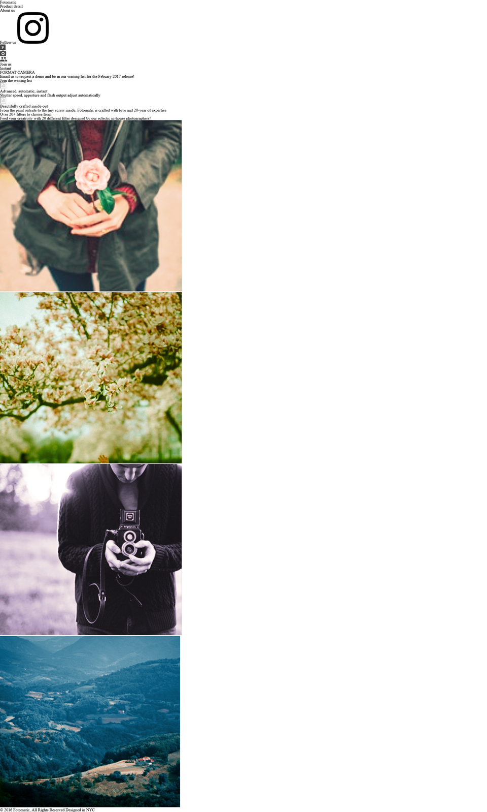
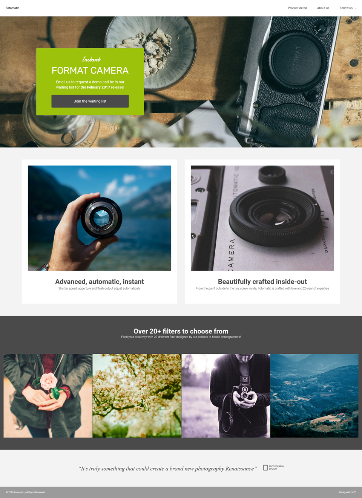

# Codecademy Project - Fotomatic

# Objective:
Fix a broken version of a responsive website in this project!

In this project, it was required of me to fix a broken version of a responsive website called Fotomatic. I was provided with specs to help guide me in making adjustments to the broken code. 

# The design specs:

  

# The state before fix:

  

# The result after fixed:

  

