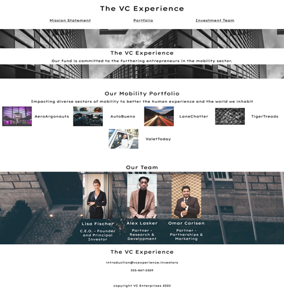
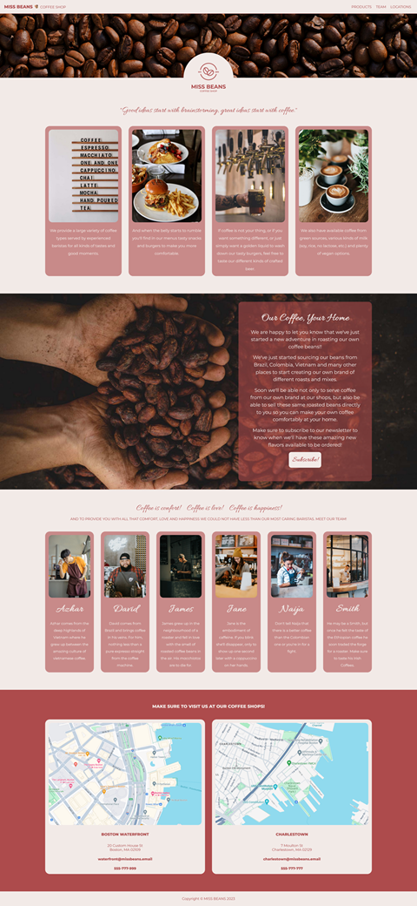
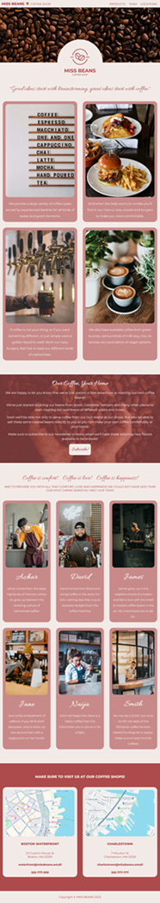

# CodeCademy Challenge Project - Company Homepage with Flexbox

The objective of this project was to create a responsive webpage for a business or company using FlexBox that may include the following:

    - A title and logo or splash image.
    - A mission statement or brief description of the company.
    - A list or set of images and titles representing the product or products of the company.
    - A section describing some of the company’s employees or teammates.

Codecademy provided a link of an example site as inspiration:
https://content.codecademy.com/PRO/independent-practice-projects/flexbox-business-site/example-site/index.html

  

# My Approach

My approach to the challenge was to create something new instead of just following the inspirational website.

Since I was drinking an embracing warm cup of coffee at the time I was starting the project, what better use-case scenario than just making a coffee shop webpage?

So I just searched for a free coffee shop logo online, chose this one...

  

 ...and started building a page around the logo, and here's the result:

  
  &nbsp;&nbsp;&nbsp;
  

Except for the logo, all images were collected from unsplash.com.

For the page I just used HTML and CSS.

# Hope you like it.

