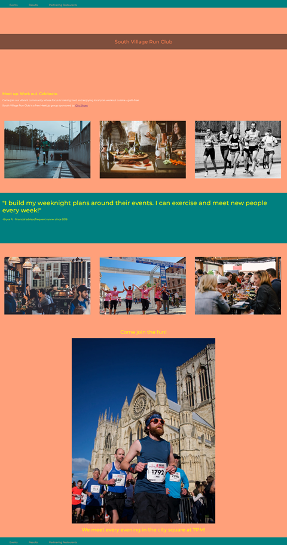

# CodeCademy Challenge Project: Responsive Club Website

# Project Goals

Building a club group page that will dynamically respond as you adjust the size of your screen! ​

# Requirements

The objective is to build a webpage for a local club. I could base it on real-life organization I belong to or make one up! I would be choosing everything about the page: the club name, the page layout and styling, any images that I may use, and more!
The project should demonstrate many of the responsive design tools learned so far and it should responsive by incorporating media queries to resize elements based on the size of the screen.

# Inspiration

The CodeCademy team provided an inspirational page in the next link:
https://content.codecademy.com/PRO/independent-practice-projects/responsive-club-site/example-site/index.html

# My Take

Generated logo with AI at Designer Image Creator by Microsoft. 

(currently in progress)